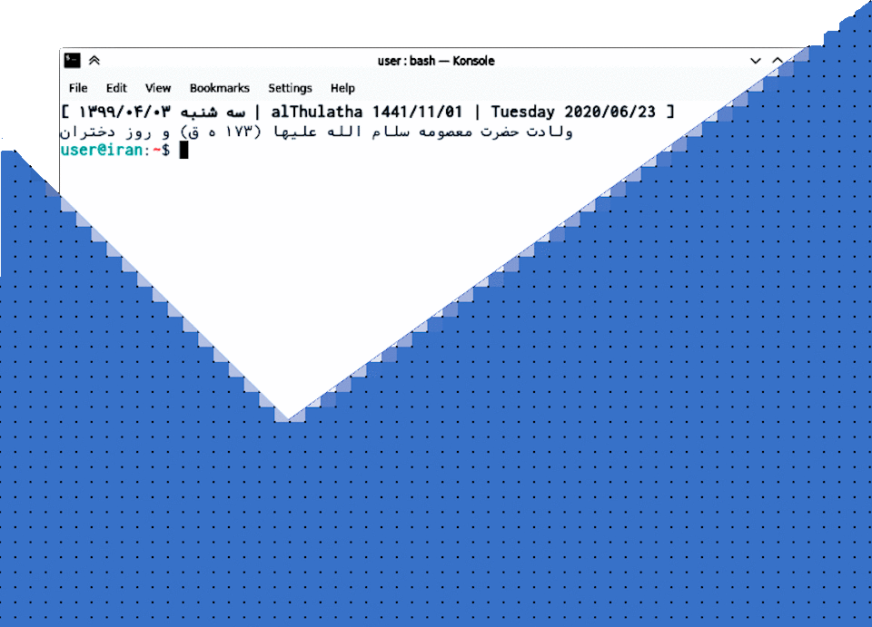

<div dir="rtl">
بسم الله

# تقویم لحظه

لحظه یک تقویم خط فرمانی هجری (شمسی و قمری) و میلادی (گرگوری) است.



## نصب برنامه

### توزیع دبیان

**۱. نصب بسته‌های پیش‌نیاز**

</div>

```bash
sudo apt install git make gcc libc6-dev locales locales-all
```

<div dir="rtl">

**۲. دریافت محتوای برنامه**

</div>

```bash
cd ~ && \
mkdir -p Apps/ && \
cd Apps/ && \
git clone https://github.com/hsabzehmeidani/lahzeh.git
```

<div dir="rtl">

**۳. ایجاد پرونده اجرایی برنامه**

در صورتی که از توزیع دبیان (پایه) ۶۴بیت استفاده می‌کنید، پرونده اجرایی برنامه در شاخه اصلی موجود است و نیازی به انجام این مرحله نمی‌باشد.

</div>

```bash
cd lahzeh/Debug/ && \
make && \
cp lahzeh ../ && \
make clean
```

<div dir="rtl">

**۴. فعال کردن دستور `lahzeh` در خط فرمان**

</div>

```bash
echo -e "\n# lahzeh calendar\nalias lahzeh='~/Apps/lahzeh/lahzeh --path ~/Apps/lahzeh/'\nlahzeh -d" >> ~/.bashrc
```

<div dir="rtl">

حال شبیه‌ساز ترمینال را به صورت دوباره اجرا کنید، تا استفاده از دستور `lahzeh` فعال شود.

در صورتی که پس از اجرای دستور زیر حروف فارسی به صورت ناصحیح نمایش داده می‌شود، پیشنهاد می‌شود از شبیه‌ساز ترمینالی استفاده کنید که حروف فارسی را به صورت صحیح نمایش می‌دهند. (مثل شبیه‌ساز `konsole`)

</div>

```bash
lahzeh -d -e
```

<div dir="rtl">

اما اگر مایل به تغییر شبیه‌ساز ترمینال خود نیستید، می‌توانید با اجرای دستور زیر زبان نمایش تاریخ را `en` کرده و نمایش رویدادها را غیر فعال کنید.

</div>

```bash
lahzeh -d --language en
```

<div dir="rtl">

## 

در صورت رضایت از برنامه، می توانید مبلغی را از طریق [@](https://zarinp.al/@sabzehmeidani) هدیه نمایید.

</div>
